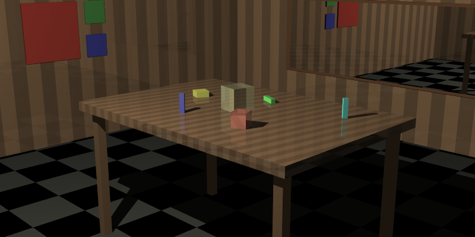
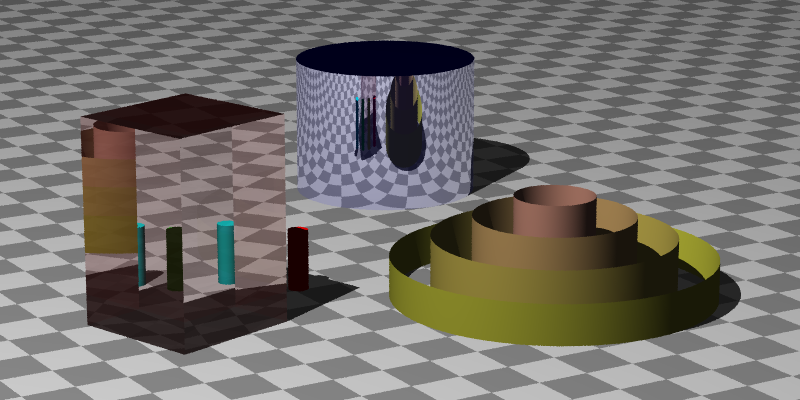
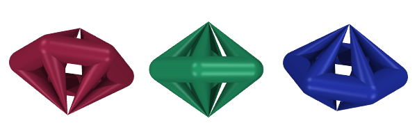
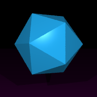
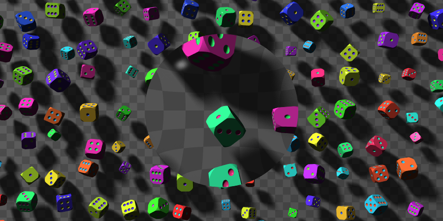
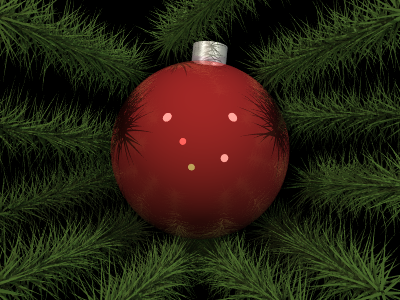

### Third raytracer

Built using _The Ray Tracer Challenge_ by Jamis Buck

To execute unit tests, run _python3 unit_tester.py_

As of now, I have implemented all features in the book.  Added several performance optimizations, such as storing the inverse transform and transpose of inverse transform for each object, rather than having to compute it with every intersection.  I have also done the three bonus chapters "Bounding boxes and hierarchies," "texture mapping," and "soft shadows" published on the book's webpage at http://www.raytracerchallenge.com  

The book lists several optional features for people to research on their own and implement.  So far, I have implemented the following:

* anti-aliasing via a Latin Hypercube (LHC) method, and an adaptive sampling method which starts looking at the four corners and center of a pixel, and then will add additional samples via iterations LHC until the new samples do not materially change the average for the pixel.
* depth of field, by giving camera optional aperture (zero means a pinhole camera, the default) and optional focal length (default of 1).
* a torus primitive

Not from this book, but based off of the _Raytracing In A Weekend_ that I used for mpraytracer, I added the concept of "fuzz" on metal and a "sky" gradient background so that an explicit object for the background would not be required.

The "saved_renders" folder contains samples from the end of each chapter, once we started rendering.  I have posted PNGs of the files from chapter 11 forward below.

* _chap5.ppm_ - rendered the silhouette of a sphere
* _chap6.ppm_ - rendered a transformed (rotated, scaled in one dimension) sphere
* _chap7.ppm_ - rendered a scene of 6 spheres (3 of them appear to be walls)
* _chap8.ppm_ - added shadows
* _chap9.ppm_ - added planes (the floor is a plane instead of a sphere)
* _chap10.ppm_ - added various patterns
* _chap11_demo.ppm_ - added reflection and refraction. 
* _chap12_demo.ppm_ - added cubes and ability to set object as not casting a shadow
* _chap13_demo.ppm_ - added cylinders.  Note I tweaked the demo image to use scaled glass cube instead of glass cylinder, as in the original image it was unclear to me that the cylinder was glass, so it looked a bit odd.
* _chap13_demo2.ppm_ - added cones.  Added a cone to the demo image and moved the light.
* _chap14_demo.ppm_ - added groups of objects, which can be transformed as a group, and support for multiple lights in a scene.
* _chap15_demo.ppm_ - added triangles and ability to read a limited set of Wavefront .obj files
* _chap15_demo2.ppm_ - the obligatory teapot.  Low-res.  Time rendering this model, which contains 240 triangles, was reduced by 86% by adding bounding boxes and hierarchies.  It takes approx 27 seconds on my laptop with 6 cores, using pypy (vs ~150 seconds with the standard python interpreter)
* _chap16_demo.ppm_ - added Constructive Solid Geometry (CSG) supports for intersections, unions, and differences.
  

* _dice_demo.ppm_ - another demo that relies on CSG.  Found on the internet (citation in demoscenes.py)
* _christmas_demo.ppm_ - after doing the bonus chapter on bounding boxes & hierarchies, was able to add this image which contains over 5000 triangles.
* _texture_mapped_earth.ppm_ - after doing the bonus chapter on texture mapping, was able to take a rectangular image of the earth and map it to a sphere.
* _texture_mapped_chapel.ppm_ - demo using a skybox
* _orrery_demo.ppm_ - the final demo from the texture map bonus chapter.
* _shadow_glamour_shot.ppm_ - the final demo from the soft shadows bonus chapter

* _dof_demo.ppm_ - simple demo of depth of field
* _torus_demo2.ppm_ - showing a classic kid's ring stack toy
* _spheres_demo.ppm_ - The final project from mpraytracer, implemented here.  Shows depth of field, "sky" background, and fuzz on the metal (which is subtle)

While not included in the print copy, Jamis Buck posted details for the scenes shown in the book for chapters 11-14 and 16 on-line.  Links can be found in demoscenes.py.

